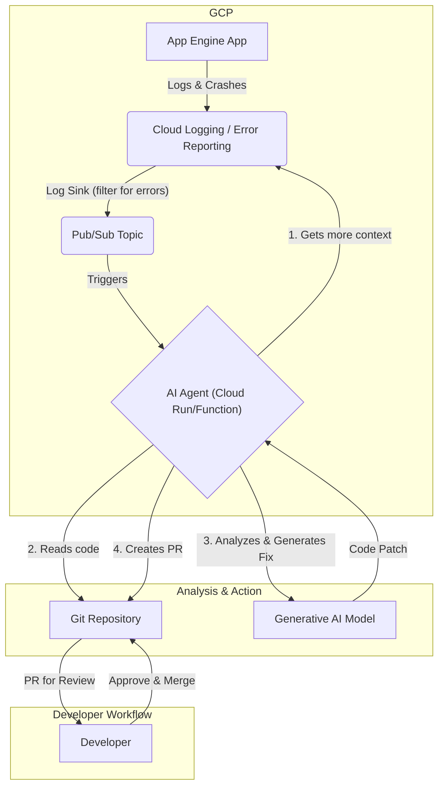

# AI Agent Architecture for Automated Bug Fixes

This diagram illustrates the end-to-end workflow for an AI agent that monitors an application, diagnoses errors, and proposes code fixes via a pull request.

